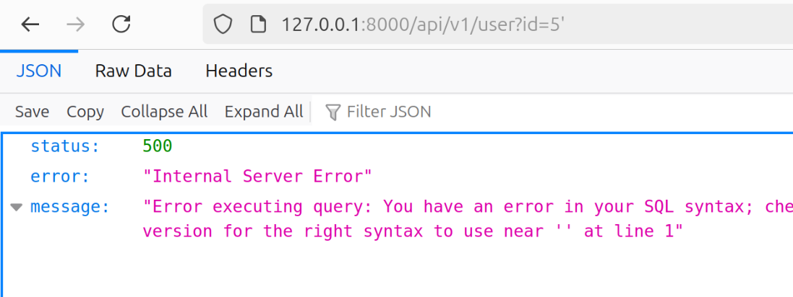

# Trapster Community


Trapster Community is a low-interaction honeypot designed to be deployed on internal networks. It is built to monitor and detect suspicious activities, providing a deceptive layer to network security.

Visit the [Trapster website](https://trapster.cloud) to learn more about our commercial product, which includes advanced features like pre-configured hardened OS, automatic deployment, webhook, and SIEM integration.

## Features

- **Deceptive Security**: Mimics network services to lure and detect potential intruders.
- **Asynchronous Framework**: Utilizes Python's `asyncio` for efficient, non-blocking operations.
- **Configuration Management**: Easily configurable through `trapster.conf`.
- **Expandable Services**: Add and configure as many services as needed with minimal effort.
- **HTTP Honeypot Engine with AI capabilities**: Clone any website using YAML configuration, and use AI to generate responses to some HTTP requests.

## Usage

### Configuration
Trapster uses a configuration file located at `data/trapster.conf`. Ensure the configuration file is correctly set up before running the daemon.
You can add as many services as you want, even multiple services of the same type.

You should also change the `interface` name, Trapster uses that to discover the IP address it should bind to. On linux, you can type `ifconfig` or `ip a`.

### Running as a script

To install Trapster, clone the repository and use `setup.py` to install the dependencies:

```bash
git clone https://github.com/0xBallpoint/trapster-community/
cd trapster-community
python -m venv venv
source ./venv/bin/activate
python setup.py install

python3 main.py -h
python3 main.py
```

### Running as a Service

To create & start a Trapster service, you need to run the following commands.
It will download the project in `/opt/trapster-community`, and create a config directory in `/etc/trapster-community`. 
You can then start and stop the service using the `service` command.

```bash
git clone https://github.com/0xBallpoint/trapster-community/ /opt/trapster-community
cd /opt/trapster-community
python -m venv venv
source venv/bin/activate
python3 setup.py install

mkdir /etc/trapster-community/
cp /opt/trapster-community/trapster/data/trapster.conf /etc/trapster-community/

echo '[Unit]
Description=Trapster Community
After=network-online.target

[Service]
Type=simple
ExecStart=/opt/trapster-community/venv/bin/python3 /opt/trapster-community/main.py -c /etc/trapster-community/trapster.conf
Restart=always
RestartSec=20

StandardOutput=append:/var/log/trapster.log
StandardError=append:/var/log/trapster.log

[Install]
WantedBy=multi-user.target' > /etc/systemd/system/trapster-community.service

service trapster-community start
service trapster-community status
```

### Running as Docker

You can also use docker compose to run and start trapster. It will use you host network.
```bash
git clone https://github.com/0xBallpoint/trapster-community/
cd trapster-community
docker compose up --build
```

## Logs

### Format
Each module can generate up to four types of logs: `connection`, `data`, `login`, and `query`.
* `connection`: Indicates that a connection has been made to the module.
* `data`: Represents raw data that has been sent, logged in HEX format. This data is unprocessed.
* `login`: Captures login attempts to the module. The data field is in JSON format and contains processed information.
* `query`: Logs data that has been processed and does not correspond to an authentication attempt. The data field is in JSON format and contains processed information.

### Log to file
By default, each log entry is printed on the standard output, in JSON format. 
You can change the way logs are generated by changing the logger name in the config file. 

For example, to log entries to a file, you can use the FileLogger class:
```
{
  ...
  "logger":{
    "name": "FileLogger",
    "kwargs":{
        "logfile": "/var/log/trapster-community.log"
    }
  }
  ...
}
```
You can then run an ELK (Elasticsearch, Logstash, Kibana) stack to explore them efficiently.

It is also possible to send the logs to an API using 
```
{
  ...
  "logger":{
    "name": "ApiLogger",
    "kwargs":{
        "url": "http://1.2.3.4:8000/api/v1/log",
        "headers": {
            "SpecialHeader1": "header value"
        }
    }
  }
  ...
}
```

## HTTP Engine with AI capabilities

The HTTP module can emulate any website. It works with YAML configuration files to match requests using regular expressions, and can generate responses using either a template or an AI model.

The configuration are stored in [trapster/data/http](trapster/data/http), each folder represent a website.
An example of the functionnalities can be found at [trapster/data/http/demo_api/config.yaml](trapster/data/http/demo_api/config.yaml)

**Structure:**
- config.yaml: contains the configuration for the website.
- files/: contains the static files for the website.
- templates/: contains the templates for the website, it supports [jinja2](https://jinja.palletsprojects.com/en/3.1.x/) syntax.

### AI ALPHA support
To generate responses, you can use the `ai` field in the configuration. For now, it uses [OVHCloud AI Endpoints](https://endpoints.ai.cloud.ovh.net/) as it is still free, and in alpha.
The file `trapster/modules/libs/ai.py` contains the code to generate responses using the AI model. It is still very basic, and will be improved in the near future.

For example, this image show a request to capture SQLi attempts, and the response generated by the AI model.



## Contributing

Contributions are welcome! Please follow these steps:

1. Fork the repository.
2. Create a new branch (git checkout -b feature-branch).
3. Make your changes.
4. Commit your changes (git commit -m 'Add new feature').
5. Push to the branch (git push origin feature-branch).
6. Create a pull request.

## License

Trapster is licensed under the GNU Affero General Public License v3 or later (AGPLv3+). See the LICENSE file for more details.

